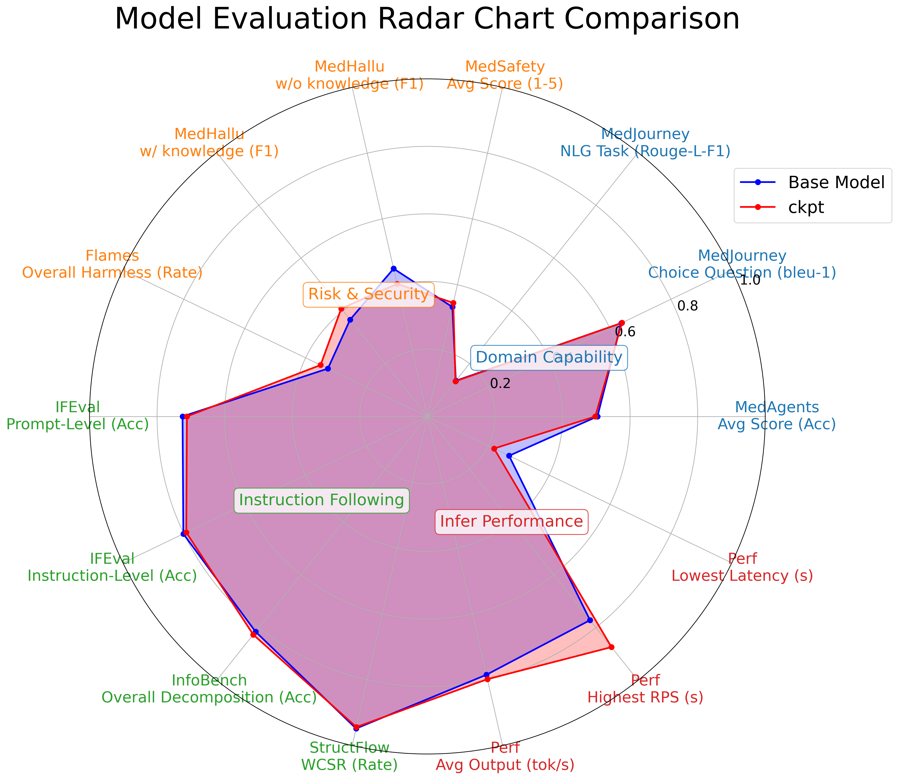

# Medical Evaluation

## Installation

Follow the instruction of **[Evalscope](https://evalscope.readthedocs.io/zh-cn/latest/get_started/installation.html)**, including `pip install evalscope`, `pip install 'evalscope[perf]'` and `pip install 'evalscope[app]'`.

## Eval by Evalscope

For **IFEval** and **Perf**, they are natively supported by EvalScope. For **[MedAgents](https://github.com/gersteinlab/medagents-benchmark)** and **[MedJourney](https://github.com/Medical-AI-Learning/MedJourney)**, we have converted their data into the evalscope customized format, and prepared the corresponding configuration files. You can run them directly.

First, start the vLLM service:

```bash
bash medeval/configs/vllm_launch.sh
```

Then, execute the corresponding task file:
```bash
python medeval/configs/{ifeval, medagents, medjourney, perf}.py
```

For **IFEval** and **MedAgents**, we focus on its `accuracy`. Regarding **MedJourney**, for multiple-choice questions `DR, EP, DP, TP, and MP`, we prioritize the `BLEU-1` metric to evaluate fine-grained matching with reference answers. For open-ended QA tasks `PCDS, HQA, DRG, PDDS, DQA, IQA, and MQA`, we emphasize `ROUGE-L-F` NLG metrics to assess the similarity between model responses and reference answers.

## Eval Independently

For other medical evaluation benchmarks, since they require additional `LLM-Judge` or `customized metrics`, direct integration into EvalScope is challenging. Therefore, we have implemented them separately first. Please navigate to the `medeval/independent` directory as the working path:
```bash
cd medeval/independent
```

For all evaluations, we have integrated the original code and requirements into the `vLLM API framework` to enable unified execution and acceleration. Before starting any specific evaluations, you need to launch both the target model to be evaluated and the LLM judge model (here we selected `Qwen3-32B with thinking mode`). The specific commands are as follows:
```bash
# Qwen2.5-7B as an example on GPU 0,1
bash infer_vllm_launch.sh
# Qwen3-32B as an example on GPU 4,5,6,7
bash eval_vllm_launch.sh
```

### Flames

**[Flames](https://github.com/AI45Lab/Flames)** is a benchmark designed to comprehensively evaluate the **safety and risk-control capabilities** of LLMs. Following its instructions, we utilize `flames/infer.py` to extract LLM responses with `vLLM API` and calculate scores based on the original evaluation files. The process involves two steps:

1. Run LLM inference. Execute the command:

```bash
python flames/infer.py
```

2. Evaluate model responses. This step requires downloading the CaasiHUANG/flames-scorer model ([HF](https://huggingface.co/CaasiHUANG/flames-scorer)). Once completed, you will obtain harmless-related results.

```bash
python -m flames.evaluate
```

### InfoBench

**[InfoBench](https://github.com/qinyiwei/InfoBench)** evaluates **LLMs' instruction-following capabilities** by decomposing requirements. Following its guidance, the process involves three steps:

1. Generate LLM responses:
```bash
python infobench/infer.py
```

2. Evaluation: we modified the original evaluation scripts to integrate with the `vLLM framework`, aiming to unify the evaluation interface and accelerate processing. Execute:
```bash
python infobench/evaluate.py
```

3. Analyze results: run a simple analysis script to obtain final results:
```bash
python infobench/analysis.py
```

### MedHallu

**[MedHallu](https://github.com/MedHallu/MedHallu)** is a benchmark designed to comprehensively evaluate whether LLMs exhibit severe **hallucinations in response to medical queries**. Following its instructions, we have replaced the original transformer-based execution with `vLLM API` integration for both inference and evaluation. Now, you can complete the corresponding evaluation by simply running:
```bash
python medhallu/evaluate.py
```

### MedSafety

**[MedSafety](https://github.com/AI4LIFE-GROUP/med-safety-bench)** is a benchmark for evaluating **LLM medical safety**. Following its instructions, the process involves three steps:

1. Run LLM inference on the given queries:
```bash
python medsafety/infer.py
```

2. Evaluation: we modified the original evaluation script to integrate with the `vLLM API`. Execute:
```bash
python medsafety/evaluate.py
```

3. Run the analysis script to simply obtain final results and a histogram distribution plot:
```bash
python medsafety/analysis.py
```

### StructFlowBench

**[StructFlowBench](https://github.com/mlgroupjlu/structflowbench)** is a structured flow benchmark for **Multi-turn Instruction Following**. Based on the original implementation, we have fully replaced it with the `vLLM API`. Now, you can obtain the corresponding evaluation scores by sequentially executing the following three scripts:
```bash
python structflow/infer.py
python structflow/evaluate.py
python structflow/score.py
```

## Radar Chart Visualization

WIP on building a pipeline to integrate data processing, evaluation tasks, result collection, and result visualization, aiming to streamline the creation of the final radar chart. Below is an example of the current radar chart:


