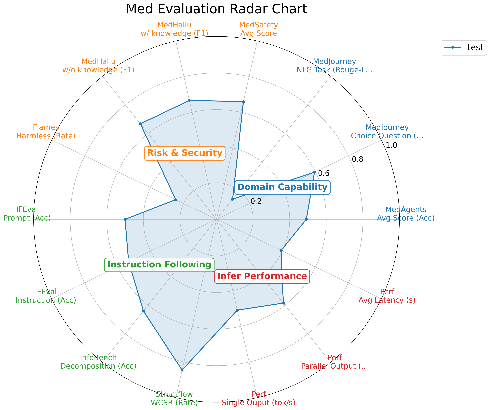

# How to use the command-line version [WIP]

## Installation
- pip install vLLM
- pip install evalscope
- pip install 'evalscope[perf]'

## Data
Uses `data/med_data_sub` for test, `data/med_data` for complete evaluation.

## Run
Start the vLLM first.
```bash
bash vllm_infer_launch.sh
bash vllm_eval_launch.sh
```

Then run the entire evaluation in `run.sh`.

> - Note: Flames evaluation need an empty GPU, hence need to reserve one for it. 
> - Note: For complete evaluation, need to set --limit to a larger number (10000).
> - Note: `--env-name` need to be set to the current environment name.

## Result
The result of the above process is as follows:


