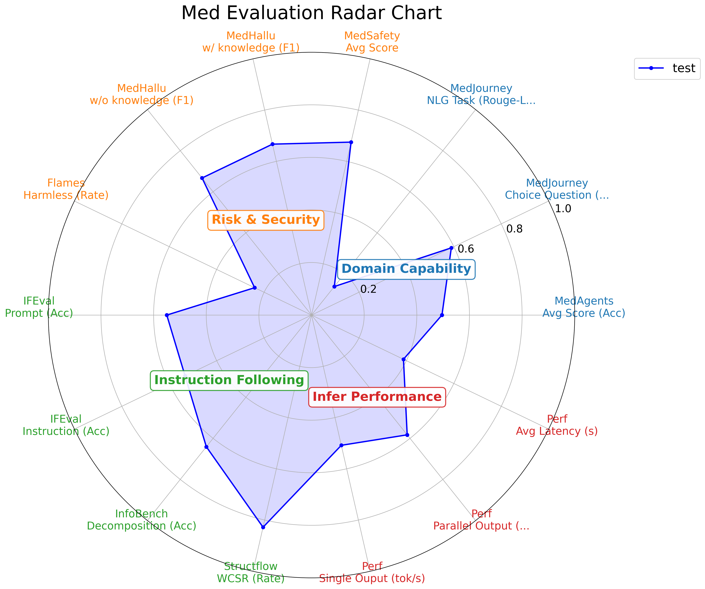

# How to use [WIP]

## Installation
- pip install vLLM
- pip install evalscope
- pip install 'evalscope[perf]'

## Configs
- vllm_infer_launch.sh: INFER_MODEL_PATH
- vllm_eval_launch.sh: EVAL_MODEL_PATH
- configs/all_in_one.yaml: FLAMES_MODEL_PATH
- configs/all_in_one.yaml: USED_ENV_NAME
- configs/perf.py: INFER_MODEL_PATH

## Data
Currently `all_in_one.yaml` uses `data/med_data_sub` to test the completeness of the process.

## Run
Start the vLLM first.
```bash
bash vllm_infer_launch.sh
bash vllm_eval_launch.sh
```

Then run the entire evaluation.
```bash
CUDA_VISIBLE_DEVICES=7 python run_eval.py --config configs/all_in_one.yaml
```

> Note: Flames evaluation need an empty GPU, hence need to reserve one for it. 

## Result
The result of the above process is as follows:


